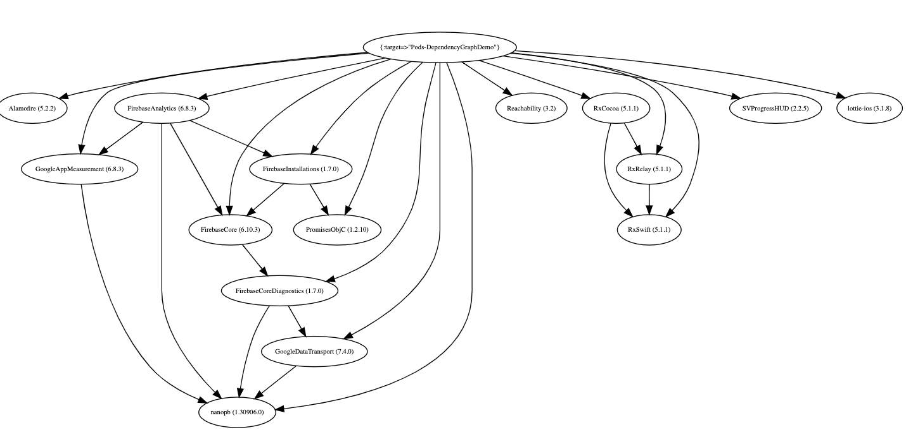

# cocoapods-dependency-graph

A Cocoapods plugin to create the dependency graph and help you manage dependencies in your project.


## Installation
### Install 

```
$ gem install cocoapods-dependency-graph
```

### Build and Install Plugin

    $ git clone git@github.com:sueLan/cocoapods-dependency-graph.git
    $ cd cocoapods-dependency-graph
    $ gem build cocoapods-dependency-graph.gemspec  && gem install cocoapods-dependency-graph  --user-install

## Usage 

1. add `plugin` in the `Podfile`

```
plugin 'cocoapods-dependency-graph'
```

2. run `pod install` 
3. output files in the project folder

In the `Podfile`, you can define `dependency_output` to decide which kind of output file this plugin generates. 

```
dependency_output :json 
dependency_output :excel
dependency_output :graph
```
There are 3 symbols to control the output format. You can choose one of them. If you don't define `dependency_output`, by default, this plugin generates `graph.jpg` and `graph.dot`. 

The following are output files you can generate: 

- `dependency_json.json`: JSON file for dependencies. You can view the json in any JSON becauty tool you like. 

  

- `graph.jpg`: A png picture shows the dependency graph

  

- `graph.dot`: A dot file which represents the dependency graph. [A site](https://dreampuf.github.io/GraphvizOnline/) that can process the dot language.  Or you can use [Graphviz](https://www.graphviz.org/theory/)

- `cocoapods-dependency-list.xlsx`: xlsx file for dependency list.  
