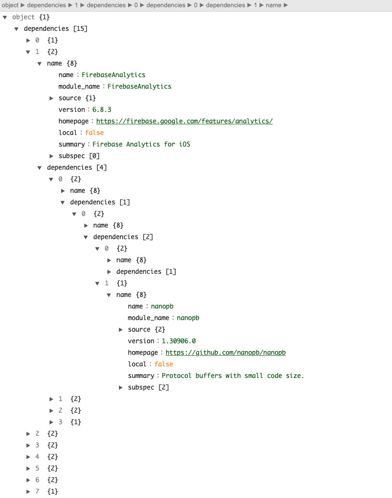

# cocoapods-dependency-graph

A Cocoapods plugin to create the dependency graph and help you manage dependencies in your project.


## Installation
### Install Dependency 
    $ gem install rgl

### Install Plugin

    $ gem install cocoapods-dependency-graph

## Usage 

1. add `plugin` in the `Podfile`

```
plugin 'cocoapods-dependency-graph'
```

2. run `pod install` 
3. find output files in the project folder
- `dependency_json.json`: JSON file for dependencies. You can view the json in any JSON becauty tool you like. 

  

- ``: A png picture shows the dependency graph

- ``: A dot file which represents the dependency graph. [A site](https://dreampuf.github.io/GraphvizOnline/) that can process the dot language.  

- `cocoapods-dependency-list.xlsx`: xlsx file for dependency list.  
